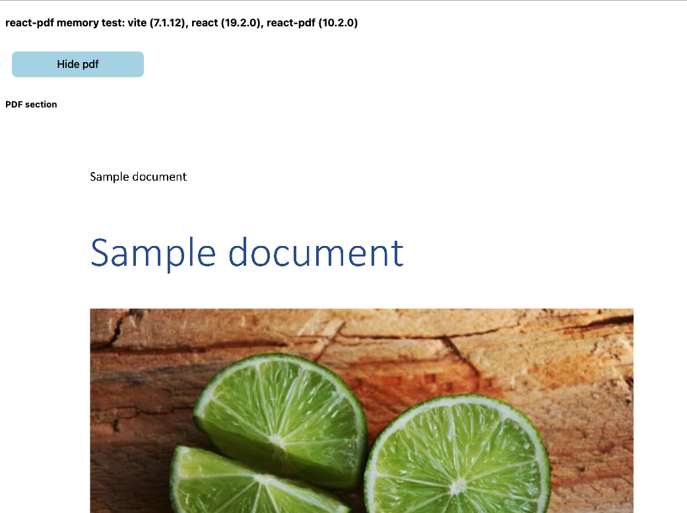

# react-pdf memory test

Check memory leakage of react-pdf with vite

## Reproduction steps

Run app locally or vercel build [here](https://react-pdf-memory-test.vercel.app/)

Steps

- Open Chrome task Manager (show `GPU Memory` column)
- `GPU Memory` should be ~ 1 MB
- Press `Show pdf` button. GPU Memory should jump to ~ 590 MB
- Press `Hide pdf` button.

Expected

- `GPU Memory` usage should drop back to ~ 2 MB

Actual

- `GPU Memory` usage remain at same high level ~ 590 MB

## Notes

- React strict mode was switched off to not affect memory
- Hot reloading was switched off to not affect memory
- Newest versions of packages were used (vite, react, react-pdf)
- High Device Pixel Rate (10) was used to amplify an effect
